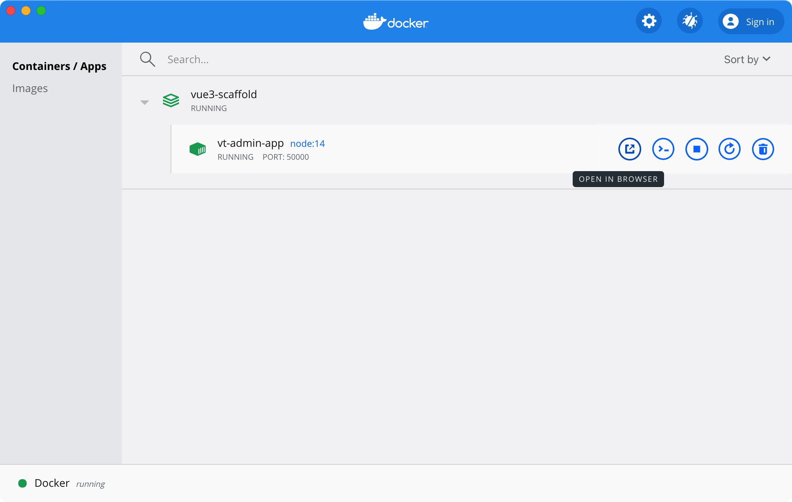

# Docker

## 发布的代码打包成Docker镜像

### 构建

将 `docker` 目录中的所有文件复制到发布目录（默认是: `app` 或者 `dist`），并在发布目录执行如下命令进行构建，其中 `myapp` 是自定义镜像名称

```bash
docker build -t myapp .
```

或者执行目录下的 `build.sh` 文件进行自动构建

### 启动

构建完成后执行如下命令进行启动

```bash
docker run -d -e API=http://api.yourdomain.com -p 8888:80 --name docker-app myapp
```
其中 `API` 的参数值为接口地址

## 使用Docker作为开发环境

在本地没有开发环境或者环境版本不对的时候可以使用此方式，直接在根目录执行如下命令进行启动

```bash
docker-compose up -d
```

启动成功后自行打开打开 [http://127.0.0.1:50000](http://127.0.0.1:50000)，或者打开 Docker 图形界面上的链接，如图：


