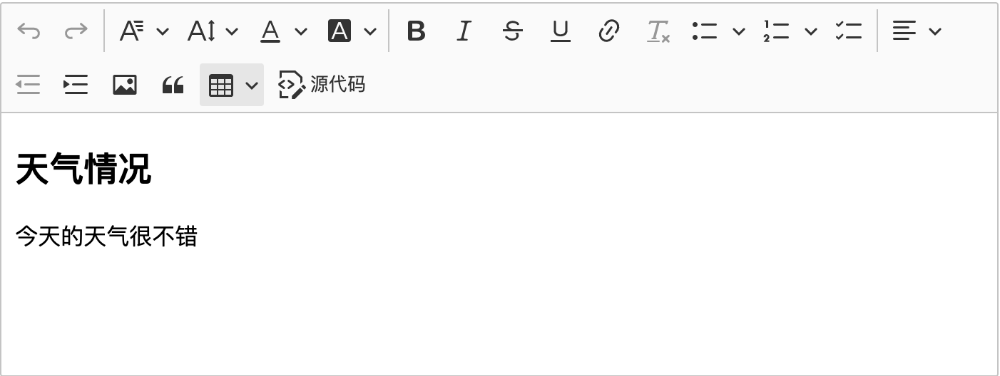

# 编辑器

编辑器使用了 `CKEditor5`，使用在线方式构建，请查看脚手架示例页面查看

# 移除 CKEditor 5

请执行下列操作

 - 删除 `plugins/ckeditor` 目录
 - 删除 `src/main.js` 文件里的 `import CKEditor from '@ckeditor/ckeditor5-vue';`
 - 删除 `src/main.js` 文件里的 `import 'ckeditor5-custom-build/build/ckeditor.css';`
 - 删除 `package.json` 文件里的 `@ckeditor/ckeditor5-vue`
 - 删除 `package.json` 文件里的 `ckeditor5-custom-build`