# 登录

## 页面

登录使用 `src/views/UserLogin.vue` 文件显示登录界面，请自行查看此文件了解更多信息。

## 过程

登录过程如下图所示

    

## 凭证

登录后获取到的凭证有2种保存方式

 - localStorage
 - cookie

可自行在 `src/setting.js` 进行设置，建议使用 `localStorage`，如果有关闭浏览器销毁凭证需求则可使用 `cookie` 方式