# 路由

## 路由加载

由 `src/routes/Index.js` 作为路由入口，另还有其他2个文件

- `BaseRoutes.js` 用于放置基础路由
- `BusinessRoutes.js` 放置业务路由，增加新路由可以在这个文件中修改

## 执行过程

下图演示了路由从开始到结束的处理过程，**注意：** 路由缓存是指缓存路由所映射的组件

     
    
     

